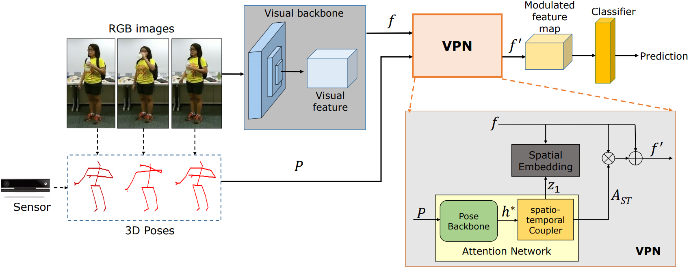

# VPN: Learning Video-PoseEmbedding for Activities of Daily Living (ECCV 2020)

## REQUIRED PACKAGES AND DEPENDENCIES

* environment.yaml file will be provided

## INSTALLATION INSTRUCTIONS

## PRE-TRAINED MODELS

Will be available soon

## Reference
<a id="1">[1]</a>
S. Das, S.Sharma, R.Dai, F. Bremond and M. Thonnat. "VPN: Learning Video-PoseEmbedding for Activities of Daily Living".
